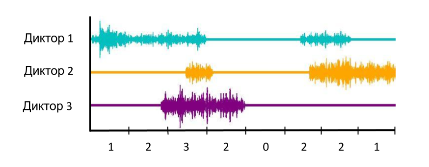
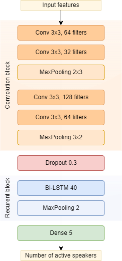
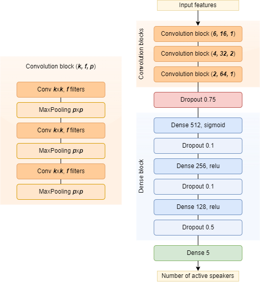
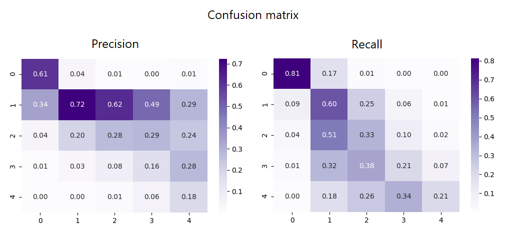

# SpeakerCounter

---
Проект для определения количества дикторов на небольшом участке записи с помощью нейронных сетей. 
Предназначен для работы с реальными данными, содержащими шумы, отдаленные голоса и пр.  

  

---
### Архитектуры моделей

В проекте есть 2 архитектуры модели: на основе Bi-LSTM [1] и CNN [2].

  
  
                 
  

---
### Признаки сигнала

Модели можно обучить на различных признаках сигнала и его длительности:

- признаки сигнала: MFCC, STFT, мел-спектрограмма
- длительность отрезка сигнала: 0,5-5 сек

---
### Пример результата

Модель на основе Bi-LSTM, использующая признаки MFCC и длительность отрезка записи 1 сек, обученная на аугментированных данных AMI корпуса [3]: 
F1-score – 0,41 для 5 классов (от 0 до 4 дикторов).

  
  

---
### REFs

1. CountNet: Stöter, Fabian-Robert et al. “Classification vs. Regression in Supervised Learning for Single Channel Speaker Count Estimation.” 2018 IEEE International Conference on Acoustics, Speech and Signal Processing (ICASSP) (2018): 436-440.
2. V. Andrei, H. Cucu and C. Burileanu, "Overlapped Speech Detection and Competing Speaker Counting–‐Humans Versus Deep Learning," in IEEE Journal of Selected Topics in Signal Processing, vol. 13, no. 4, pp. 850-862, Aug. 2019.
3. AMI Corpus: I. Mccowan, J. Carletta et al. The AMI meeting corpus. Int'l. Conf. on Methods and Techniques in Behavioral Research. 2005
